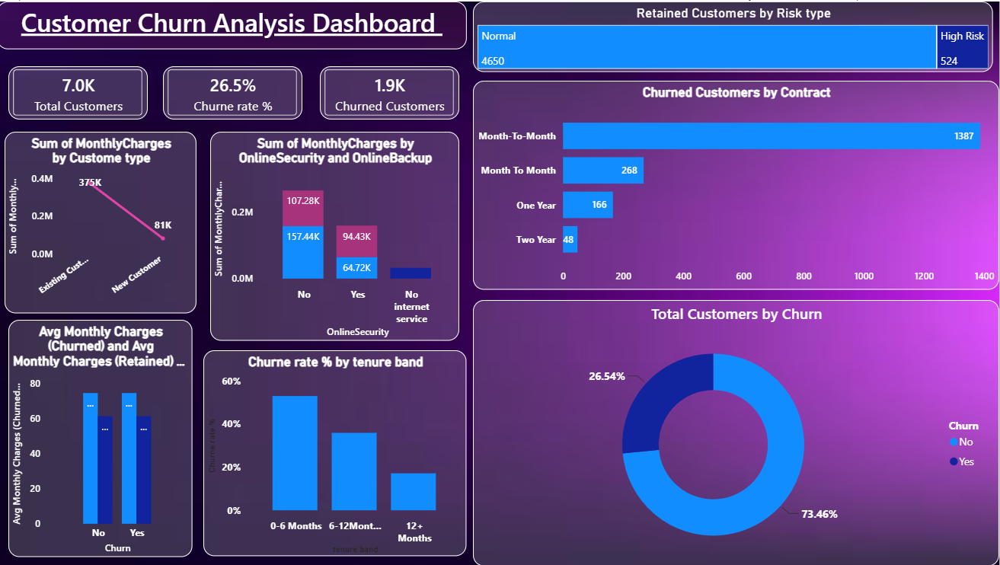

# Customer Churn Analysis Dashboard

## Overview
Interactive **Power BI dashboard** analyzing customer churn for a telecom company. This project provides deep insights into churn patterns, customer behavior, and retention opportunities.

### Key Metrics
- **Total Customers**: 7,000
- **Churn Rate**: 26.5%
- **Churned Customers**: 1,900
- **Retained Customers**: Normal (4,650) | High Risk (524)

### Dashboard Features
- Churned customers by contract type (Month-to-Month highest at 1,387)
- Monthly charges by customer type and security services
- Churn rate by tenure band
- Average monthly charges (Churned vs Retained)
- Overall churn distribution (Donut chart)

## Technologies Used
- Power BI Desktop
- DAX Measures
- Data Visualization (Bar, Column, Donut charts)

## How to Explore
1. Download the `Customer_Churn_Analysis.pbix` file
2. Open with **Power BI Desktop** (Free)
3. Use slicers and filters to interact with the visuals

## Key Insights
- Month-to-Month contracts show significantly higher churn
- Customers with 0-6 months tenure have the highest churn rate (~52%)
- New customers contribute heavily to monthly charges
- High-risk retained customers identified for targeted retention

## Future Improvements
- Churn prediction model
- Customer segmentation
- Retention strategy dashboard

---

**Built for Data Analytics Portfolio**  
*Last updated: June 2026*
